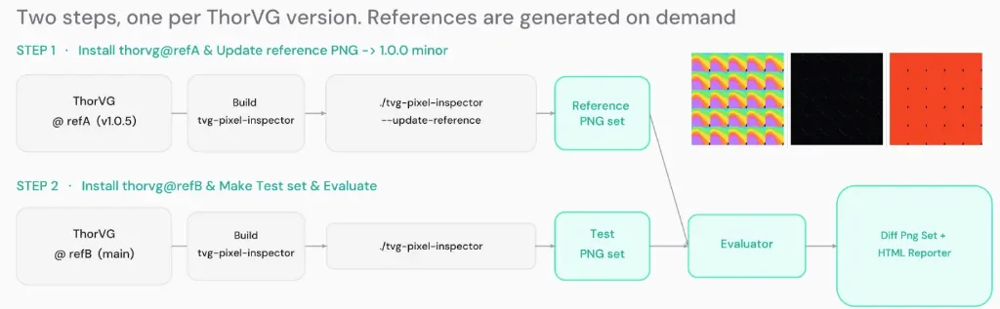
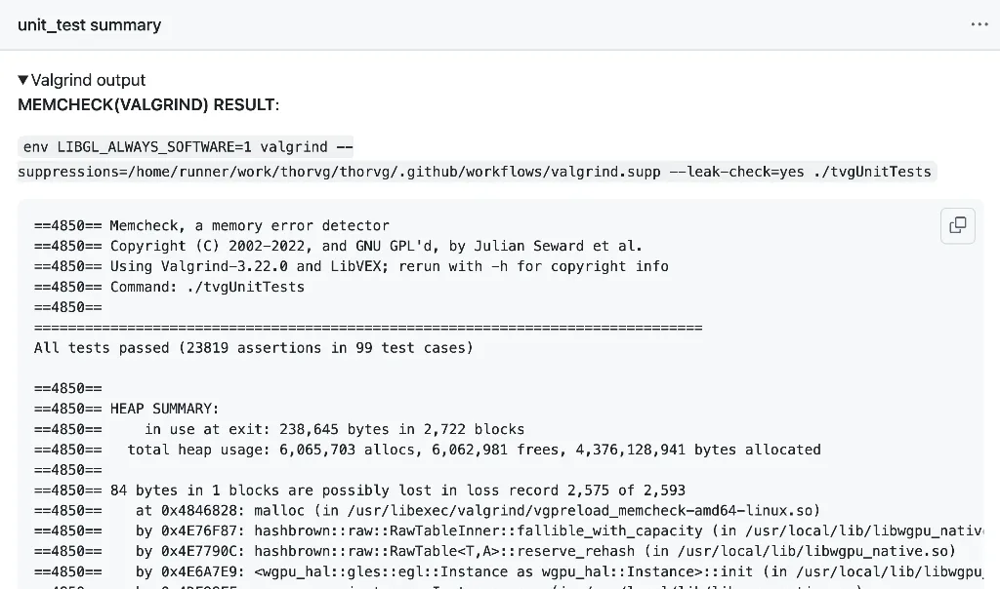
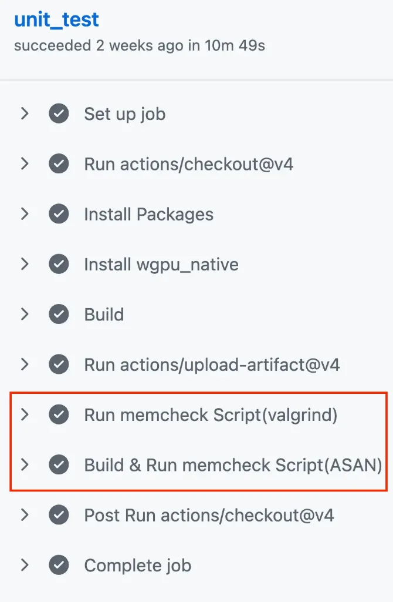
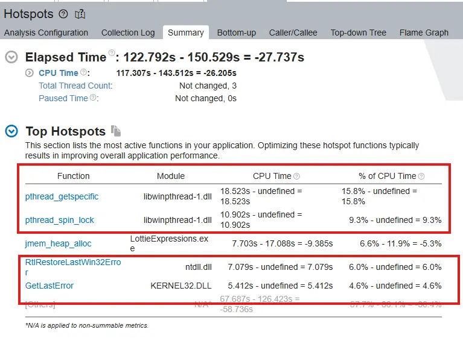
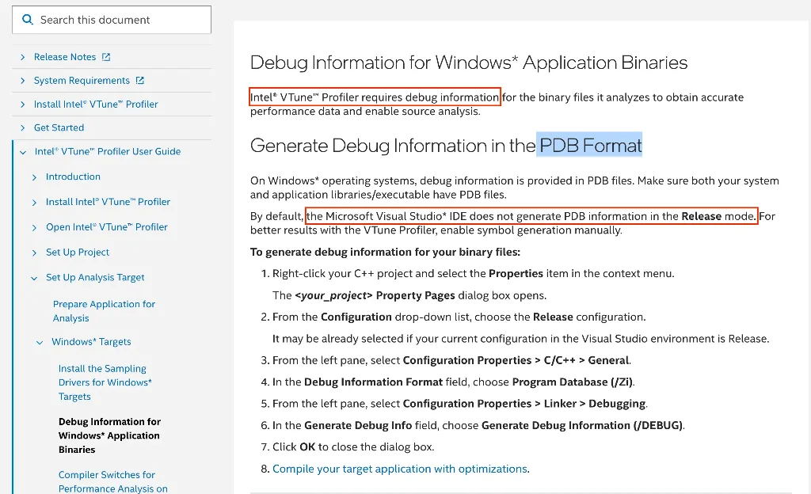
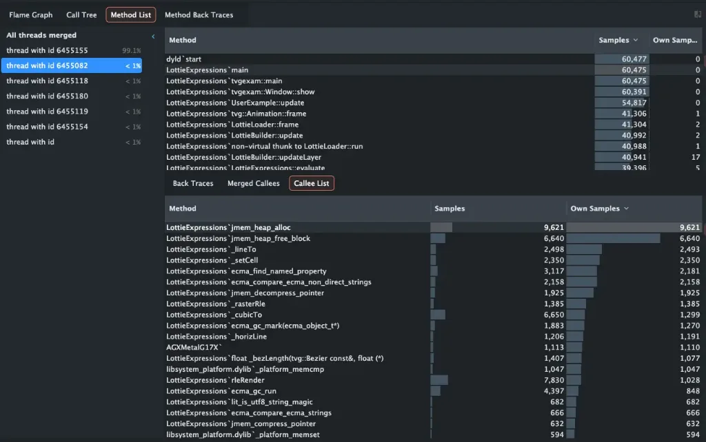
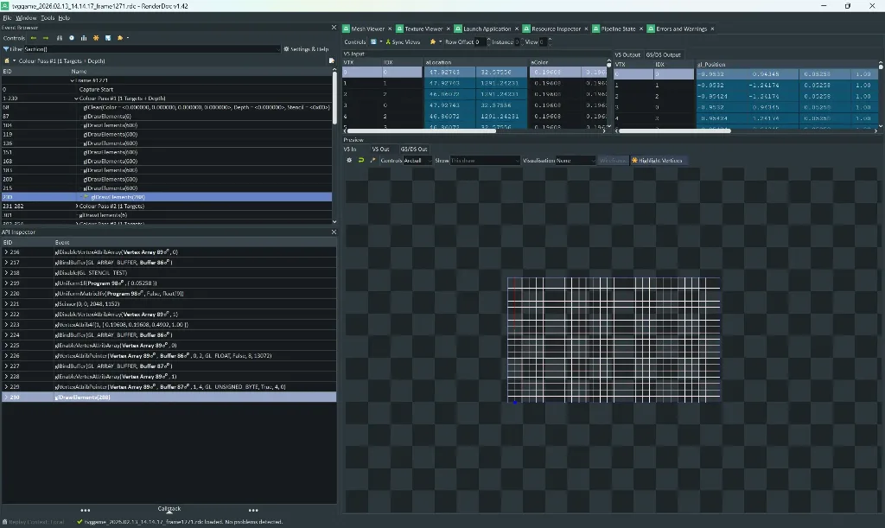
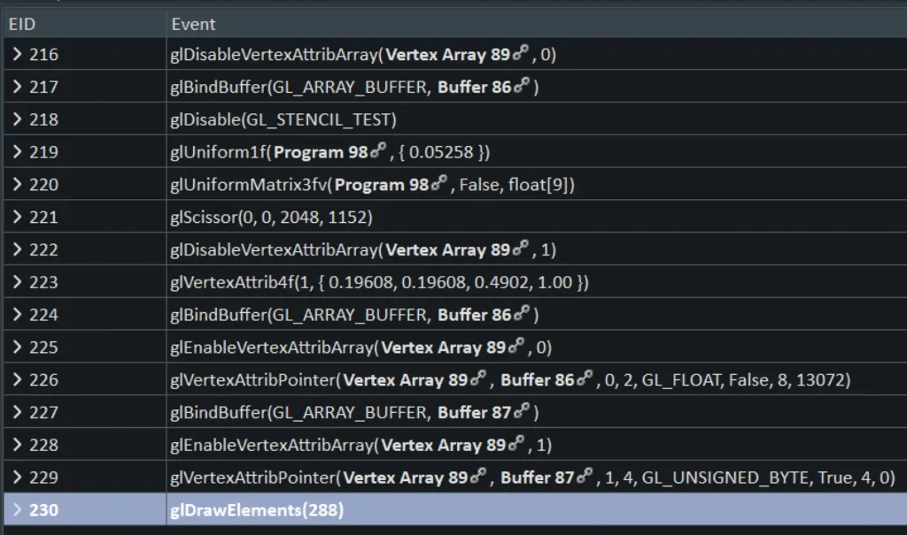
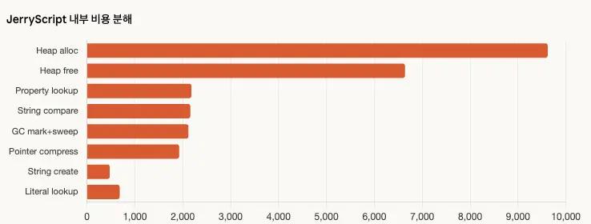
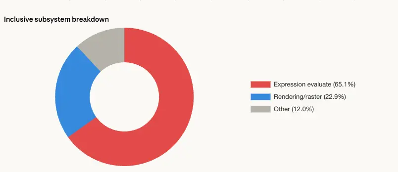

# Core2026 - 4

## 1. Test

### 1.1 Pixel Inspector와 Golden Image

- **검증:** Golden Image 준비 → 결과 이미지 생성 → 픽셀 차이 비교 → 위치와 색상 값 확인

ThorVG Pixel Inspector를 사용하면 Golden/GM 결과를 시각적으로 확인할 수 있습니다.

### 1.2 Unit Test와 메모리 검사

| Unit Test와 메모리 검사 | 메모리 오류 검사 결과 |
| --- | --- |
|  |  |

- **Unit Test:** API 사용 측면 테스트 -> 엔진 내부 코드 커버리지 용도
  - API 사용 측면에서 문제가 일어나지 않는지? (ex, 참조 관리, update, draw, sync 엔진 내부 상태 등등)
- **Valgrind:** 메모리 누수 · 초기화되지 않은 메모리 · 잘못된 읽기와 쓰기
- **AddressSanitizer:** heap buffer overflow · stack buffer overflow · use-after-free · double free

## 2. Debugging

### 2.1 디버거와 디버그 정보

ThorVG 는 멀티플랫폼 엔진이기 때문에 다양한 툴을 사용하며, 다양한 도구를 사용하며 개발 할 수 있습니다.

> [ThorVG Package Distribution](https://github.com/thorvg/thorvg/wiki/Package-Distrubution) 여러 패키지로 배포되고 있으며 다양한 환경에 익숙해져야합니다.

- **IDE:** Visual Studio Code · CLion · Visual Studio
- **디버거:** GDB · LLDB
- **정보:** Linux·Unix 계열의 DWARF · Windows MSVC 도구 체인의 PDB
- **기능:** breakpoint · call stack · local variable · watch expression · conditional breakpoint · memory view · disassembly

## 3. Profiling

- **도구:** Visual Studio Profiler · Intel VTune Profiler · CLion Profiler · Apple Instruments · Tracy
- **측정:** 함수별 실행 시간 · 호출 횟수와 스택 · 스레드별 CPU 사용률 · lock 대기 시간 · 메모리 할당 빈도 · cache miss와 branch miss

### 3.1 VTune

| VTune 프로파일링 결과 | VTune과 PDB 설정 |
| --- | --- |
|  |  |

- **분석:** CPU hotspots · 스레드 동시 실행 상태 · 메모리 접근 병목
- **조건:** 배포 환경과 유사한 최적화 · 디버그 심볼 유지 · 심볼 파일 검색 경로 설정

PDB가 없거나 분석 대상 바이너리와 일치하지 않으면 함수 이름과 소스 라인 분석이 제한될 수 있습니다.

### 3.2 CLion Profiler

CLion에서 프로파일러를 실행하면 IDE 안에서 함수별 비용, 호출 관계, 소스 라인별 비용, flame graph를 연결하여 확인할 수 있습니다.

(VTune, Visual Studio, Instruments 보다는 자세하지 않습니다.)

CLion의 macOS 프로파일러는 DTrace를 기반으로 합니다.

### 3.3 Android Studio

- **기반:** Android 10+ System Trace는 Perfetto 기반
- **형식:** `.perfetto-trace` · Android Studio의 메서드 추적은 별도의 `.trace` 형식
- **웹:** [Perfetto UI](https://ui.perfetto.dev/)에서 Perfetto trace 열기 · SQL 문을 활용하여 관심 있는 부분의 데이터를 쉽게 조회

### 3.4 Android GPU Inspector

- **도구:** [Android GPU Inspector](https://developer.android.com/agi)
- **기반:** AGI System Profiler는 Perfetto 기반
- **방식:** Vulkan 명령 직접 추적 · OpenGL ES 명령은 ANGLE을 통해 Vulkan 명령으로 변환 후 추적
- **분석:** CPU·GPU frame time · GPU counter와 병목 · render pass와 draw call · framebuffer · pipeline과 render state · shader와 texture · GPU memory
- **OpenGL ES:** Frame Profiler는 ANGLE 기반 분석 · System Profiler는 GPU counter만 지원

### 3.5 Apple Instruments(CPU)

- **도구:** [Apple Instruments](https://developer.apple.com/documentation/xcode/performance-and-metrics)
- **기반:** Time Profiler의 주기적 sampling · Apple Silicon의 Processor Trace hardware tracing
- **Time Profiler:** 함수별 CPU hotspot 탐색
  - **Weight:** 해당 함수와 하위 호출이 표본에 포함된 횟수 · inclusive cost
  - **Self Weight:** 해당 함수 자체가 실행 중일 때 수집된 표본 수 · exclusive cost
  - **Top Functions:** 호출 경로와 관계없이 동일 symbol의 Self Weight를 합산하여 hotspot 순으로 정렬
  - **Invert Call Tree:** 무거운 callee를 기준으로 호출자를 역방향 추적
  - **Flame Graph:** block 너비로 표본 비중과 heaviest stack trace 확인
- **Processor Trace:** 샘플링 방식보다 개별 함수 실행을 정확하게 추적
  - ex) 아주 미세한 부분의 성능 측정
- **분석:** CPU call tree · thread state · 함수 호출과 실행 시간

### 3.6 Tracy

- **도구:** [Tracy Profiler](https://github.com/wolfpld/tracy)
- **방식:** 소스 코드에 Tracy client와 zone 계측을 별도로 추가한 뒤 viewer로 실시간 telemetry 전송
- **장점:** 별도의 계측 작업이 필요하지만 관심 구간을 직접 지정해 CPU·GPU 실행 시간 · frame · memory allocation · lock · context switch를 정밀 분석

### 3.7 RenderDoc(GPU)

### 3.8 Apple Instruments(GPU)

- **도구:** Metal System Trace
- **분석:** CPU·GPU frame timeline · command buffer · encoder · GPU 실행 시간

### 3.9 프로파일링 결과 데이터 추출 후 AI 에 입력

### 3.10 프로파일링 팁

- **SQL:** 관심 구간의 쿼리를 저장하고 메모하여 반복 분석에 재사용
- **코드 포함 프로파일링:** Android Trace·Perfetto의 trace section과 Apple Instruments의 signpost를 코드에 삽입
- **라벨:** 대량의 프로파일링 데이터에 관심 구간의 시작·끝과 이름을 기록하여 타임라인 탐색과 구간 쿼리를 단순화

## 4. 성능 측정

- [thorvg.benchmark](https://github.com/thorvg/thorvg.benchmark)
  - ThorVG · Skia
  - CPU · OpenGL · WebGPU
  - Rect · Circle · Stroke · Image · Linear Gradient · Radial Gradient
  - 기본 · 회전
  - 평균 · 중앙값 · p95 · p99 · FPS
- [hyperfine](https://github.com/sharkdp/hyperfine)
  - 단일 명령 · 비애니메이션 작업
  - Loader · 빌드 시간 · 프로그램 시작부터 Saver 완료까지
  - 반복 측정 · warmup · 통계 분석 · 결과 내보내기
- [thorvg.example](https://github.com/thorvg/thorvg.example)
  - Lottie · Animation 등 패치와 관련된 example 테스트
  - 애니메이션 반복 측정 · 출력 FPS 평균
  - warmup 1–2회
- 로그 출력

### 4.1 반복 호출되는 함수의 성능 측정(Instruments)

- **분석 방식:** 관심 구간 기반 프로파일링 · Region-of-Interest Profiling
- **도구:** [Processor Trace](https://developer.apple.com/documentation/xcode/analyzing-cpu-usage-with-processor-trace)
- **목적:** 한 작업 구간에서 반복 호출되는 함수의 호출 횟수 · 누적 실행 시간 · 구간 내 실행 시간 기여도 측정

#### 4.1.1 Inspection Range 설정

1. Processor Trace에서 대상 Run과 process track 선택
2. 상세 화면을 `Function Calls`로 변경
3. 관심 구간을 나타내는 상위 함수 검색
4. 측정할 호출의 `Duration`을 Control-click
5. `Set Inspection Range` 선택

`Inspection Range`는 상위 함수의 진입부터 반환까지로 제한된 관심 구간입니다. OS Signpost로 기록한 named interval이 있다면 타임라인에서 해당 interval을 선택하여 같은 방식으로 관심 구간을 고정할 수 있습니다.

#### 4.1.2 Summary: Function Calls 집계와 기여도 계산

1. 상세 화면을 `Summary: Function Calls`로 변경
2. 하단 `Input Filter`에서 반복 호출되는 대상 함수의 symbol 선택
3. 대상 process와 thread 선택
4. `Count` · `Active Duration` · `Cycles` · `Instructions` · `Average IPC` 확인

- **호출당 평균 실행 시간:** `Target Active Duration / Count`
- **구간 내 실행 시간 기여도:** `Target Active Duration / Inspection Range Duration × 100`
- **함수 실행 시간 개선율:** `(Before Active Duration - After Active Duration) / Before Active Duration × 100`

이 방법은 한 작업 구간 안에서 동일 함수가 여러 번 호출될 때 누적 비용과 실행 시간 점유율을 측정하는 데 적합합니다. 단일 스레드에서 대상 호출이 관심 구간에 포함되고 입력과 호출 횟수가 동일한 경우 전후 비교가 명확합니다.

멀티스레드의 누적 active duration은 wall-clock inspection range보다 커질 수 있습니다. 재귀 호출이나 중첩 호출은 시간이 중복 집계될 수 있으며, 하위 함수 호출을 포함한 시간인지 함수 자체 실행 시간인지 구분해야 합니다. 최적화 전후 비교는 동일한 빌드 · 입력 · thread 조건에서 여러 번 측정하고 중앙값을 비교합니다.
