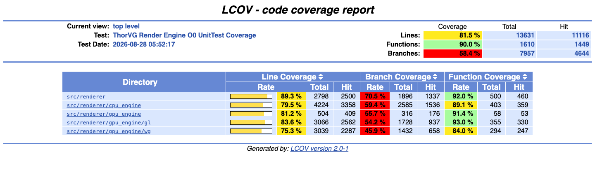
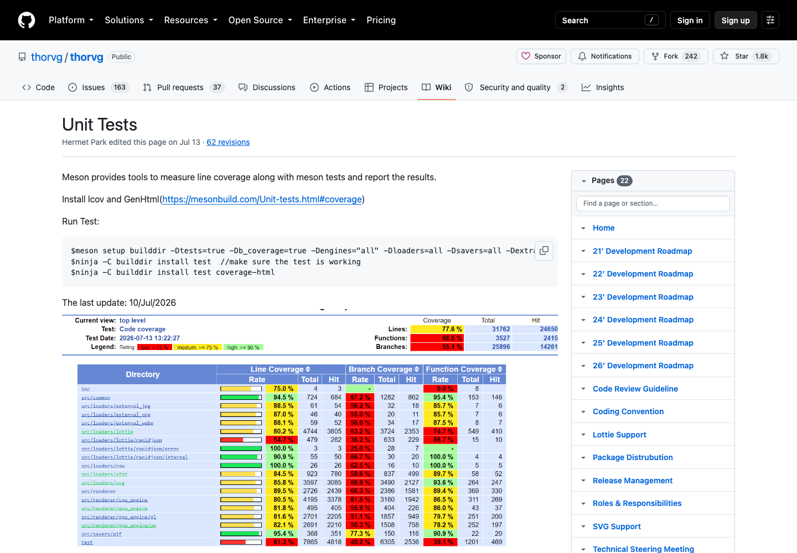
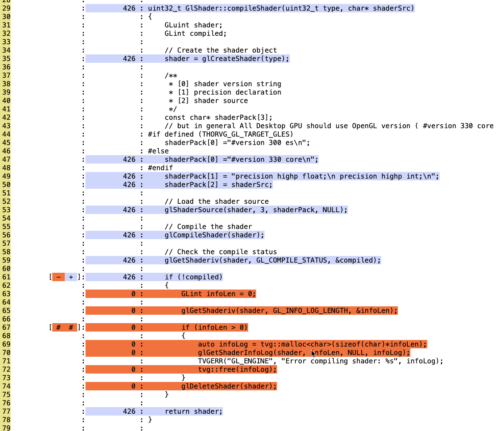
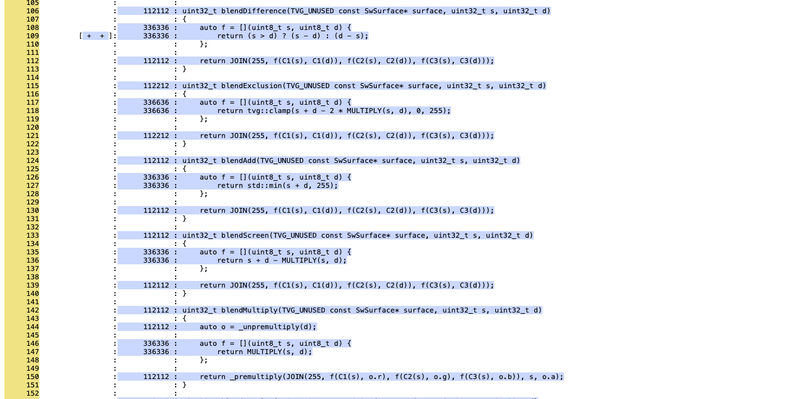

# Core2026 - 4



- thorvg 는 Catch2 test executable을 타겟으로 Line Coverage를 관리하고 있음 (80% 이상)
- Coverage는 실행 여부
    - Line coverage는 실행 파일에 포함된 executable source line 중 테스트가 한 번 이상 실행한 라인의 비율
    - Function coverage는 함수 진입 여부를 집계
    - Branch coverage는 조건식과 분기의 실행 여부를 집계
- thorvg unittest: API 사용 -> 엔진 내부 코드를 커버하는 테스트 코드를 작성해야함


## 1. ThorVG Wiki의 Unit Test 실행 방법



- [ThorVG Unit Tests Wiki](https://github.com/thorvg/thorvg/wiki/Unit-Tests)
    -  Meson test와 LCOV·GenHTML을 함께 사용
        - `b_coverage=true`는 compiler와 linker에 coverage instrumentation을 적용
        - `coverage-html` target은 실행 후 생성된 counter를 수집해 HTML report를 생성

```shell
meson setup builddir \
  -Dtests=true \
  -Db_coverage=true \
  -Dengines="all" \
  -Dloaders=all \
  -Dsavers=all \
  -Dextra=""

ninja -C builddir install test
ninja -C builddir install test coverage-html
```

### 2. coverage-html



- 빨간 부분: 현재 ThorVG 의 유닛 테스트에서 실행되지 않은 라인
- 파랑 부분: 현재 ThorVG 의 유닛 테스트에서 실행된 라인


### 3 . LineCoverage -> UnitTest




```text
src->blend(BlendMethod::Exclusion)
└─ Paint::blend()
   └─ Paint::Impl::blend()
      └─ ShapeImpl::render()
         └─ SwRenderer::blend()
```

소스의 흐름을 보고 -> 적절한 테스트 코드작성
- 현재 테스트 코드를 다듬거나, 새로운 테스트 코드를 작성하여 커버리지를 높일 수 있음
