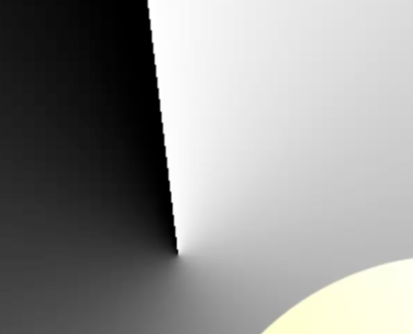
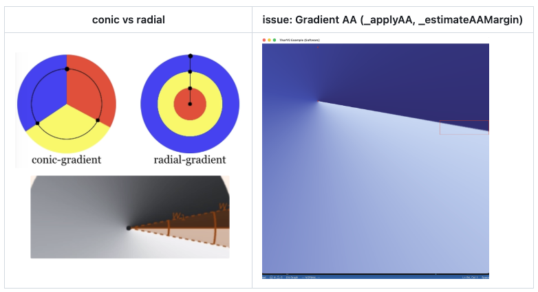

import TMathPlayer from '../../../components/TMathPlayer.astro';
import GradientFillLab from '../../../components/GradientFillLab.astro';
import conicScene from './LUA/conic-series/_conicT.lua?url';
import pixelScene from './LUA/conic-series/_conicPixel.lua?url';
import conicPoster from './IMAGE/07-SW-Fill/conic-series/conic-lookup.webp';
import pixelPoster from './IMAGE/07-SW-Fill/conic-series/conic-pixel-fill.webp';

# Core2026 > Issue - 12

## 1. Conic Gradient와 seam AA

<TMathPlayer scene="conic-lookup" source={conicScene} poster={conicPoster.src} crop={[0, 170, 720, 880]} title="conic-lookup" description="원본 _conicT: 110도에서 출발한 샘플과 LUT 포인터가 함께 움직이고 350도에서 375도로 seam을 넘어 index를 되감는 영상" />

- Conic wrap: 각도에서 이미 `[0, 1)`로 들어오므로 일반 spread의 범위 밖 처리와 구별

```cpp
static inline float _conicT(const SwFill* fill, float rx, float ry)
{
    auto t = atan2f(ry, rx) * (0.5f / MATH_PI) + fill->conic.offset;
    return t - floorf(t);
}

// fillConic(..., SwBlenderA op, uint8_t a)
for (uint32_t i = 0; i < len; ++i, ++dst) {
    *dst = op(_pixel(fill, _conicT(fill, rx, ry)), *dst, a);
    rx += conic->a11;
    ry += conic->a21;
}
```

### 1.1. seam AA 품질






### 1.2. AA가 필요한 구간만 남기기

.png)

<TMathPlayer scene="conic-pixel-fill" source={pixelScene} poster={pixelPoster.src} crop={[0, 170, 720, 1040]} end={27.45} hold={1.6} title="conic-pixel-fill" description="원본 _conicPixel: NORMAL AA NO AA 첫 사례의 전체 경로를 추적하고 48개 픽셀을 순회해 surface에 Conic Gradient를 완성" />

<GradientFillLab mode="aa" />
