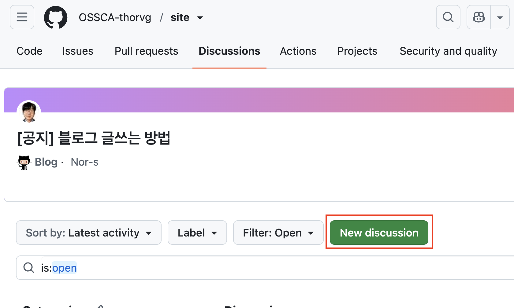
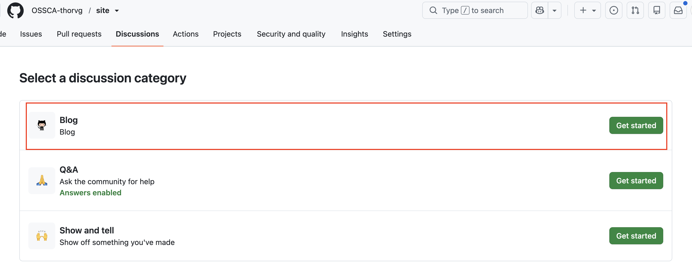
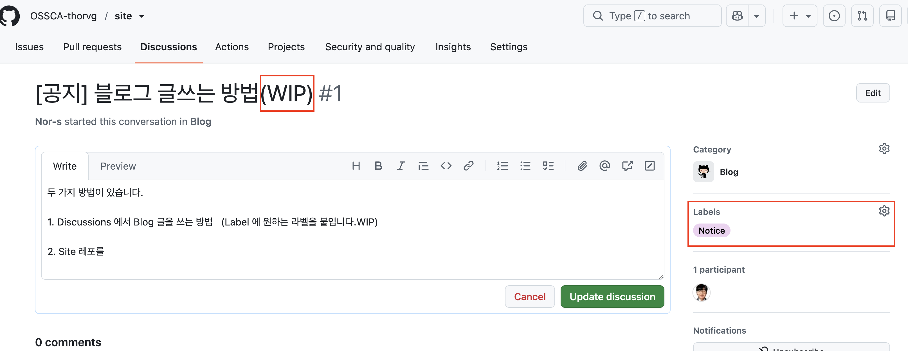
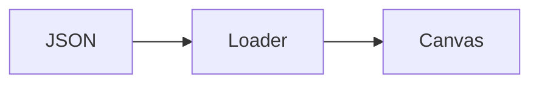

블로그에 글을 올리는 방법을 안내드립니다. 어렵지 않으니 편하게 따라와 주세요.

## 어떤 글을 쓰면 되나요

주제는 자유롭게 정하셔도 됩니다. ThorVG와 관련이 없어도 괜찮습니다.
예를 들면 이런 글들을 편하게 올려 주세요.

- 오늘 공부한 내용
- ThorVG 분석에 관한 내용
- 프로젝트 셋팅에 관한 내용
- 이슈 분석 해결에 관한 글
- 빌드하다가 막힌 부분과 해결 과정
- 코드 리뷰를 받으며 알게 된 내용
- 오픈소스 기여를 준비하면서 정리한 메모
- 자신의 블로그 글 공유

글이 짧아도 전혀 괜찮습니다. 나중에 본인이나 다른 멘티분이 빠르게 참고할 수 있다면
그것만으로 충분합니다.

## Discussion에서 글쓰기






GitHub의 [Site 저장소 Discussions](https://github.com/OSSCA-thorvg/site/discussions)에서
`New discussion` 버튼을 누르고 `Blog` 카테고리를 선택하시거나, 블로그 목록의 `글쓰기`
버튼을 눌러 작성 화면을 여실 수 있습니다. 




제목, 본문, 라벨을 작성해 주시면 됩니다. 

아직 작성 중인 글이라면 제목 끝에 `(WIP)`을 붙여 주세요. 
`(WIP)`을 제거하고 저장하면 다음 빌드에서 사이트에 공개되고, 
공개된 글에 `(WIP)`을 다시 붙이면 사이트에서 내려갑니다. 

이후 Discussion 본문을 수정하면 다음 빌드에 자연스럽게 반영됩니다.
블로그 상세 페이지의 댓글도 같은 Discussion의 답글로 저장됩니다.

이미지와 GIF는 Discussion 본문에 바로 붙여넣으실 수 있습니다.

## GitHub Markdown 확장 문법

> [!NOTE]
> Discussion에서 작성한 표, 체크박스, 취소선, 자동 링크 같은 GitHub Markdown 문법은
> 사이트에서도 그대로 표시됩니다. 강조 안내문이 필요하다면 아래처럼 작성해 주세요.

```md
> [!NOTE]
> 렌더링 파이프라인을 살펴보기 전에 빌드 옵션을 확인하세요.
```

안내문 종류로는 `NOTE`, `TIP`, `IMPORTANT`, `WARNING`, `CAUTION`을 사용하실 수 있습니다.

Mermaid 다이어그램은 `mermaid` 코드 블록으로 작성하시면 됩니다.



````md

````

사이트에서는 다이어그램으로 렌더링되며, 밝은 테마와 어두운 테마에 맞춰 색상도 자연스럽게
바뀝니다.

<details className="guide-details">
<summary>저장소에 직접 Markdown으로 글쓰기</summary>

로컬에서 MDX를 사용하거나 미디어를 저장소에 함께 보관하고 싶을 때 사용할 수 있는
대체 방식입니다.

## 파일 만들기

직접 파일을 작성하는 경우 `src/content/blog/` 아래에 추가해 주세요.

파일 이름은 영어 소문자, 숫자, 하이픈을 섞어서 짧게 지어 주시면 좋습니다.

```text
src/content/blog/my-first-thorvg-note.mdx
src/content/blog/rendering-study.md
```

확장자는 `.md` 또는 `.mdx`를 사용합니다. 보통 Markdown만 쓰신다면 `.md`,
JSX 컴포넌트가 필요하다면 `.mdx`를 선택하시면 됩니다.

## TEMPLATE 사용하기

새 글을 만들 때는 `src/content/blog/TEMPLATE` 파일을 열어 내용을 복사해 시작하시면
편합니다. 이 파일은 확장자가 없는 템플릿입니다.

기본 템플릿은 이런 형태입니다.

```md
---
title: "글 제목"
github: "github-id"
date: 2026-07-10
tags: ["thorvg", "study"]
draft: false
---


본문을 작성하세요.
```

복사한 뒤 `github`, `title`, `date`, `tags`만 본인 글에 맞게 바꿔 주시면
됩니다.

## 로컬에서 확인하기

글을 쓰는 중에 바로 확인하고 싶을 때는 개발 서버를 사용해 주세요.

```bash
npm run dev
```

브라우저에서 `http://localhost:4321/blog`로 들어가면 새 `.md` 또는 `.mdx` 글을 확인하실 수 있습니다.

빌드된 결과로 확인할 때는 순서가 조금 다릅니다.

```bash
npm run build
npm run preview
```

한 가지 주의하실 점은, `npm run preview`는 새로 빌드하지 않는다는 것입니다. 이미
만들어진 `dist/` 폴더만 보여주기 때문에, 글을 추가하거나 수정하셨다면 `npm run build`를
다시 실행한 뒤 preview를 켜 주세요.

로컬에서 preview로 확인할 때는 `BASE_PATH` 없이 빌드하시는 것이 좋습니다.
`BASE_PATH=/site` 같은 빌드는 GitHub Pages 배포용 링크를 만들기 때문에 로컬 preview의
경로와 다를 수 있습니다.

## Frontmatter 작성하기

글 맨 위의 `---`로 감싼 영역을 frontmatter라고 부릅니다. 사이트는 이 정보를 읽어서
목록 카드, 작성자, 검색, 태그 필터, 날짜 표시를 만듭니다.

```md
---
title: "블로그 글쓰는 방법"
github: "Nor-s"
date: 2026-07-10
tags: ["Notice"]
draft: false
---
```

`title`은 글 제목입니다. 블로그 목록 카드와 상세 페이지 제목으로 표시됩니다.

`github`는 작성자의 GitHub 아이디입니다. `@github-id` 형태의 작성자 표시와 GitHub
프로필 링크, 아바타에 사용됩니다. 이름을 따로 쓰지 않고 GitHub 아이디만 적어 주시면
됩니다.

`date`는 글 날짜입니다. `2026-07-10`처럼 `YYYY-MM-DD` 형식으로 작성해 주세요.


`tags`는 블로그 목록의 카테고리 필터에 사용됩니다. 여러 개를 넣으셔도 됩니다.

```md
tags: ["thorvg", "study"]
```

`draft`는 공개 여부입니다. `true`면 사이트에 공개되지 않고, `false`면 공개됩니다.

글을 작성 중일 때는 `draft: true`로 두고, PR을 보낼 때 공개할 글이라면 `draft: false`로
바꿔 주세요.

## 대표 미디어 넣기

본문의 첫 번째 이미지나 GIF가 블로그 목록 카드의 대표 미디어가 됩니다.
본문에서는 미디어가 가운데 정렬되고, 대괄호 안 텍스트는 캡션으로 표시됩니다.

기본으로는 ``처럼 대괄호를 비워 캡션 없이 넣으시면 됩니다.
캡션이 필요할 때만 ``처럼 쓰면 이미지 아래에
`렌더링 결과`가 표시됩니다.

## 미디어 저장 위치

경로는 항상 MDX 파일 위치 기준입니다. 어떤 파일 안에서 쓰느냐에 따라 `./cover.png`가
가리키는 위치가 달라지니 이 부분만 조금 유의해 주세요.

권장하는 방식은 글마다 폴더를 만들고, 그 안에 `index.mdx`와 미디어를 함께 두는 것입니다.
글 파일은 `src/content/blog/my-post/index.mdx`처럼 만들어 주세요.

```text
src/content/blog/my-post/index.mdx
src/content/blog/my-post/cover.png
src/content/blog/my-post/demo.gif
```

`index.mdx` 안에서는 같은 폴더의 파일을 바로 참조할 수 있습니다.

```md


```

여기서 `./cover.png`는 `index.mdx`와 같은 폴더의 파일을 뜻합니다.

단일 파일을 `src/content/blog/my-post.mdx`로 만들고 미디어만 하위 폴더에 두셔도 됩니다.

```text
src/content/blog/my-post.mdx
src/content/blog/my-post/cover.png
```

이 경우 `my-post.mdx` 기준에서 하위 폴더로 들어가야 하므로 경로가 달라집니다.

```md

```

반대로 `my-post.mdx` 안에서 ``라고 쓰면
`src/content/blog/cover.png`를 찾게 되니 참고해 주세요.

이 상대 경로는 빌드할 때 `blog-assets/` 아래로 복사되어 블로그 목록 카드와 상세 본문에서
같은 파일을 사용합니다.

이미지나 GIF도 같은 방식으로 넣으시면 됩니다.

```md


```

대표 미디어가 꼭 필요한 것은 아닙니다. 본문에 미디어가 없으면 블로그 목록에는
기본 ThorVG 마크가 표시됩니다.

## 본문 작성하기

본문은 일반 Markdown 문법으로 작성하시면 됩니다.

```md
## 오늘 본 코드

`tvg::Canvas` 초기화 흐름을 따라가 봤습니다.

- 어떤 파일을 봤는지
- 이해한 내용
- 아직 헷갈리는 부분
```

기술적으로 완벽한 글보다, 나중에 다시 읽었을 때 생각의 흐름이 보이는 글이 더 유용할
때가 많습니다.

막힌 부분이나 아직 해결하지 못한 부분도 편하게 남겨 주세요. 다른 사람이 이어서 도와주기
훨씬 쉬워집니다.

## PR 보내기

GitHub 웹에서 글을 작성하셨다면 아래 순서로 PR을 보내 주세요.

1. `src/content/blog/` 아래에 새 `.md` 또는 `.mdx` 파일을 만듭니다.
2. `src/content/blog/TEMPLATE` 내용을 복사해 새 파일에 붙여 넣습니다.
3. frontmatter를 본인 글에 맞게 수정합니다.
4. 본문을 작성하고, 첫 번째 미디어가 의도한 대표 이미지인지 확인합니다.
5. 화면 아래의 커밋 영역에서 브랜치 생성 옵션을 선택합니다.
6. 커밋 메시지는 `Add blog post about ...`처럼 글 추가임을 알 수 있게 적습니다.
7. `Propose changes`를 누릅니다.
8. 이어서 `Create pull request`를 눌러 PR을 만듭니다.

PR 설명에는 글의 목적을 짧게 적어 주시면 충분합니다.

```md
## 내용

- ThorVG 빌드 과정에서 정리한 내용을 블로그 글로 추가했습니다.
- 렌더링 결과 이미지를 함께 추가했습니다.
```

</details>

기능 추가 아이디어나 불편한 점이 있다면 언제든
[이슈](https://github.com/OSSCA-thorvg/site/issues/new)로 알려 주세요.
[Site 저장소](https://github.com/OSSCA-thorvg/site)에 직접 기여해 주셔도 좋습니다.
읽어 주셔서 감사합니다.
